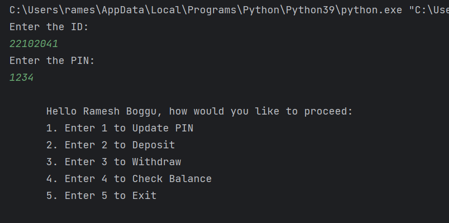
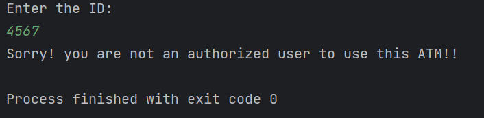
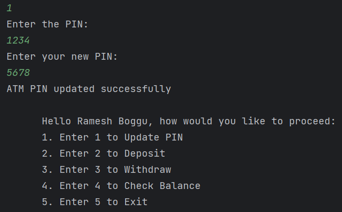
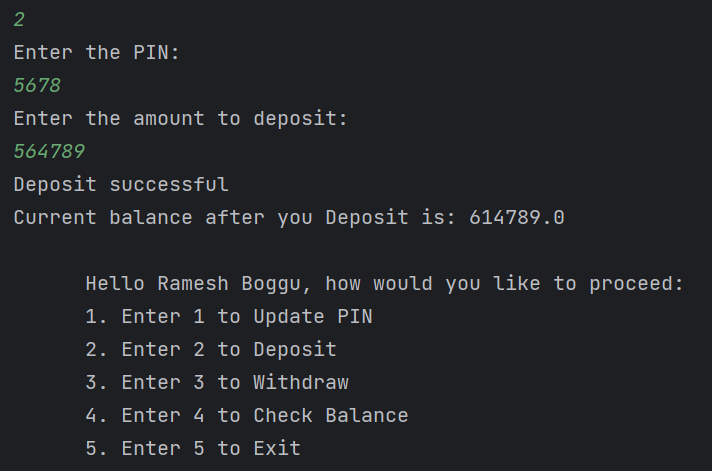
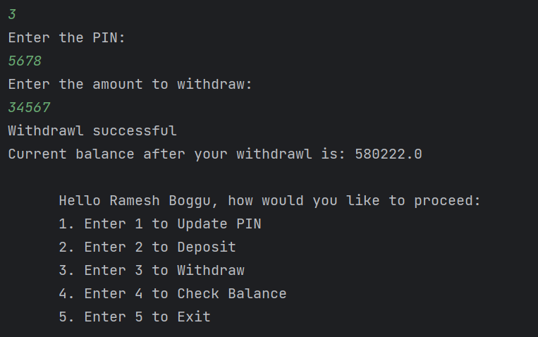
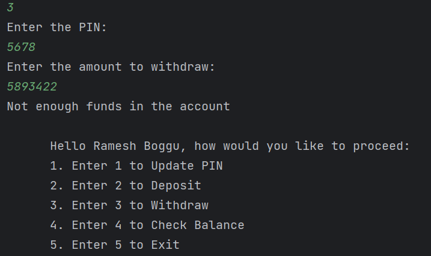
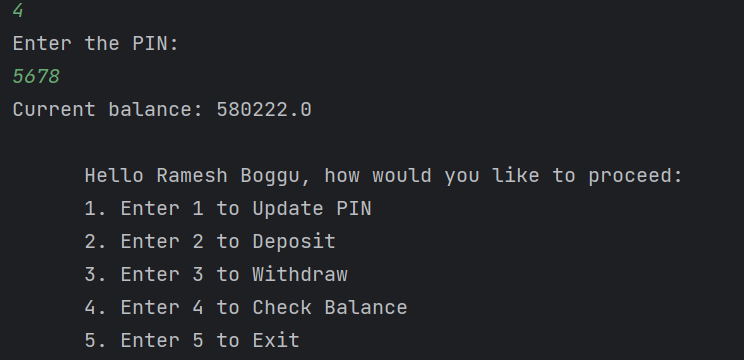
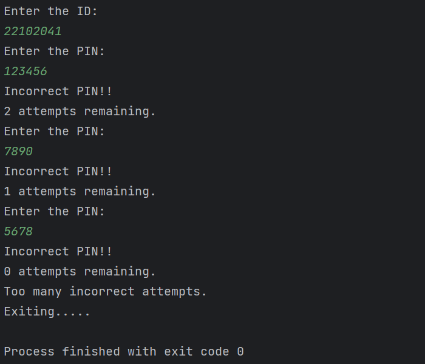

# Bank Atm Simulation using Python

Tried to mimic the ATM using Python by using Object Oriented Programming principles like _Encapsulation_.
# Overview:

In this project, first created ATM class with some instance variables. They are :

1. db : which represents database of different customers of bank who had the access to use the ATM. It is a dictionary.

2. in_id : we take input for this, which is the id given to the customer, this is already present in the db.

3. run : variable which is used to run the program, this is used to get out of the program.

4. menu() : this method is used to take the input for the  operation user want to execute and call respective method.

This is starting of program:

if the entered id doesn't present in database, it will exit from the program.

Then defined the methods for all the different operations which out ATM can execute.

_update_pin()_: this method is called to update the pin of the user, it  also used the _authenticate()_ method for authenticating the user.

_deposit()_ : this method is called when the user want to deposit money, this also uses _authenticate()_ method and also uses _get_amount()_ to get the deposit money.

_withdraw()_ : this method is called when the user want to withdraw money from the ATM. This also uses _authenticate()_ method and _get_amount()_ method. Also uses as condition whether the withdraw amount is greater the actual amount present in the bank account of user.

When the withdraw process is carried out correctly.

When the withdraw process is carried out wrongly by giving input greater than available balance.

_check_balance()_ : used to check the balance of the user bank account.

_authenticate()_ : this method takes the input of the pin and check with the pin corresponding to the id present in the database. This method also checks for wrong pin, and if the wrong pin was used more than 3 times, the program will be automatically exited.

_get_amount()_ : this method checks for the input of amount is correct or not, like whether it is positive or not.

